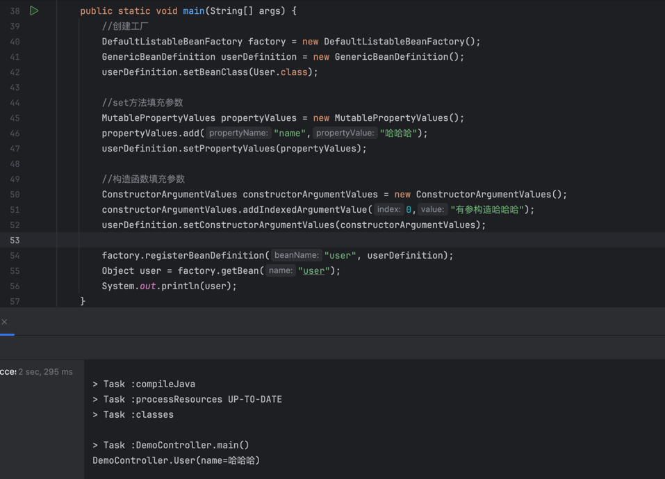

## BeanDefinition 讲解

`Spring 源码中一个非常重要的概念：BeanDefinition`

### 相关接口概念
    BeanDefinition 是spring用来描述bean信息的元数据
    BeanDefinitionRegistry beanDefinition容器，可以理解为map
    BeanDefinitionReader 读取BeanDefinition 
    BeanFactory bean工厂,可以创建bean

### 流程
    BeanDefinitionReader 读取BeanDefinition,放入BeanFactory，
    BeanFactory通过getBean来生成实例
    
    

### spring boot 注册流程
    首先在项目启动后，
    在refreshContext(刷新上下文)=>invokeBeanFactoryPostProcessor(工厂后置处理器)
    =>invokeBeanDefinitionRegistryPostProcessors =>ConfigurationClassPostProcessor=>

