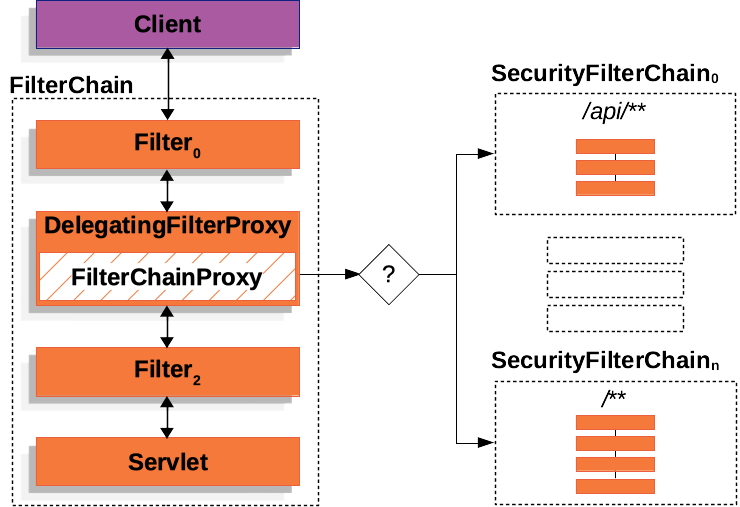

# Spring Security 过滤器链解析
Spring Security 的所有逻辑都是基于过滤器链的，
这里简单介绍一下 Spring Security 的过滤器链。

## 1. ApplicationFilterChain

- `ApplicationFilterChain` 实现了 `FilterChain`，由 Tomcat 构建此过滤器链。
- 由 `ApplicationFilterFactory.createFilterChain(request, wrapper, servlet);` 创建。
- 过滤器列表示例：`[... DelegatingFilterProxy]`。

## 2. DelegatingFilterProxy

- `DelegatingFilterProxy` 是一个过滤器，间接注册在 `ApplicationFilterChain` 中。
- 它是 `WebMvcSecurityConfiguration.CompositeFilterChainProxy` 的装饰器。

## 3. CompositeFilterChainProxy
- `CompositeFilterChainProxy` 是 Security 真实的过滤器链。
- 它是一个过滤器链代理，里面有 `List<Filter> doFilterDelegate` 作为核心属性。

## 4. doFilterDelegate 过滤器链

- `doFilterDelegate` 会构建一个 `VirtualFilterChain` 过滤器链，
  其中包含 `[HandlerMappingIntrospector.createCacheFilter, FilterChainProxy]`。

## 5. FilterChainProxy

- `FilterChainProxy` 是 Spring Security 提供的过滤器链代理。
- 其中包含 `List<SecurityFilterChain> filterChains`，管理不同请求的不同过滤器链。
- 通过url路径匹配具体的 `SecurityFilterChain`。

## 6. SecurityFilterChain

- 其实现类 `DefaultSecurityFilterChain`，是具体的过滤器链对象。
- 其中包含构建 `FilterChain` 的过滤器和匹配规则。
- 主要属性：
    - `RequestMatcher requestMatcher`
    - `List<Filter> filters`
- `FilterChainProxy` 通过 `requestMatcher` 匹配 `filters`。

## 7. VirtualFilterChain

- `VirtualFilterChain` 是 `FilterChainProxy` 的一个内部类。
- 它是 `FilterChain` 的具体实现。
- 在第 2 步获取到过滤器后，会构建 `VirtualFilterChain`，
  这个链是真正的 Spring Security 过滤器链。

具体参考官网的这个图片：

