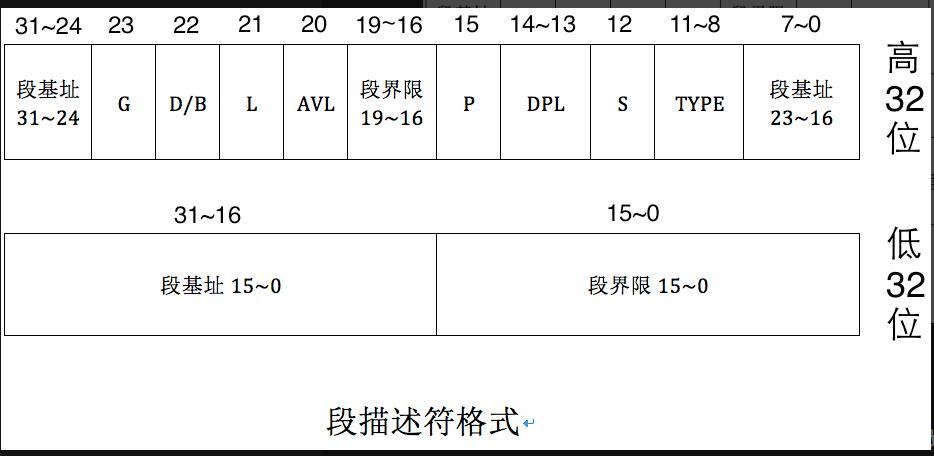

# 段描述符

### 段基址: 32位宽  在16-31(16) 32-29(8) 56-63(8位)
### 段界限：即能寻址的最大范围(20位)(单位量)(字节/4kb)
### g: 0 1字节 1 4k  (2的20次方=1m) (1m*4k=4g)
### s: 0 系统段(不是硬件需要的都不是系统段) 1 数据段
### type: 4位  x r c a  x(执行) r(读) c(一致性) a(是否访问过) a是cpu设置的(设置为0由cpu改)
### dpl: 描述符权限级 2位 越小权限越大
### p：段是否存在 在内存中是1 不在是0 如果是0,cup会抛异常
### avl: 可用位
### l: 1 64位代码段 32是0
### D/B: d=0 16位 1 32位
### G: 指定段界限的单位大小

# gdt 段描述符表 用于存储段描述符(数组)(通过下标查找各个gd)

# gdtR 即存放gdt的寄存器,存放gdt的首地址

gdtr寄存器 是全局描述符的指针 48位  32位gdt起始地址 16位gdt界限
只能使用lgdt指令操作

# 选择子

选择子是16位数, 存放在段寄存器里(cs,ds,ss) 实模式时是段基址地址,保护模式时是选择子
保护模式 段基址地址已经存在段描述符里了,所以选择子里存放的是指向gdt里的某个段描述符的索引

ti: 0 gdt(全局描述符) 1 ldt(局部描述符)
rpl: 请求特权级 2位

# 段描述符缓冲寄存器
目的： 段描述符在内存中,频繁访问速度较慢,所以引入段描述符缓冲寄存器

