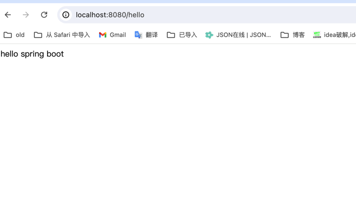
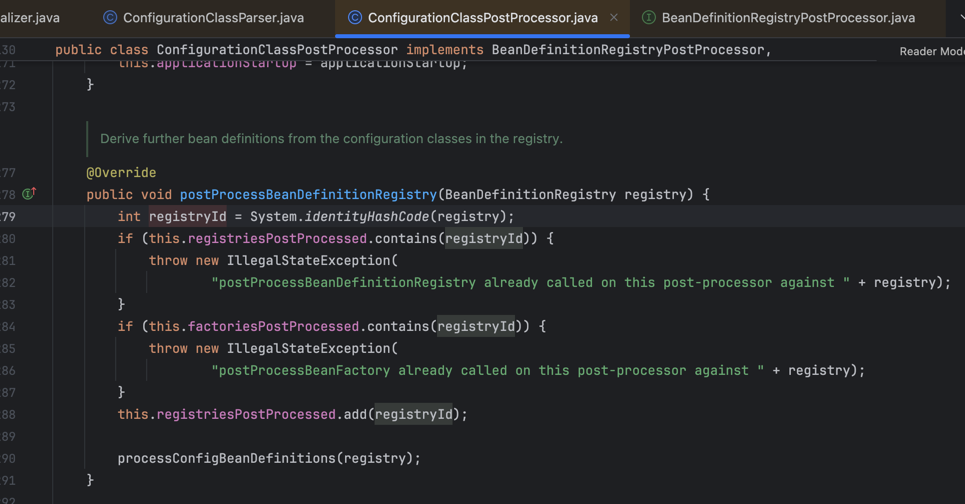

# 2024年7月23日工作任务安排

## 1. 学习 Spring 框架的基本概念和组件（如 Spring Core, Spring MVC）

### Spring Core

- **概念**：Spring Core 是整个 Spring 框架的基础部分，提供了依赖注入（DI）和面向切面编程（AOP）功能。
- **组件**：
    - **BeanFactory**：Spring 的核心容器，负责创建和管理 Bean。
    - **ApplicationContext**：在 BeanFactory 基础上增加了更多企业特性，如事件传播、声明式机制等。

### Spring MVC

- **概念**：Spring MVC 是一个基于 Model-View-Controller 设计模式的 Web 框架。
- **组件**：
    - **DispatcherServlet**：中央控制器，负责分发请求。
    - **Controller**：处理请求的控制器。
    - **View**：展示数据的视图。

## 2. 编写并运行一个简单的 Spring Boot 应用

### 步骤

1. **创建 Spring Boot 项目**：
    - 使用 [Spring Initializr](https://start.spring.io/) 创建项目。
    - 选择需要的依赖，如 Spring Web。

2. **编写主程序类**：
    ```java
    package com.example.demo;

    import org.springframework.boot.SpringApplication;
    import org.springframework.boot.autoconfigure.SpringBootApplication;

    @SpringBootApplication
    public class DemoApplication {
        public static void main(String[] args) {
            SpringApplication.run(DemoApplication.class, args);
        }
    }
    ```

3. **编写控制器类**：
    ```java
    package com.example.demo;

    import org.springframework.web.bind.annotation.GetMapping;
    import org.springframework.web.bind.annotation.RestController;

    @RestController
    public class HelloController {
        @GetMapping("/hello")
        public String hello() {
            return "hello spring boot";
        }
    }
    ```

4. **运行应用**：
    - 使用 IDE 或者命令行运行主程序类 `DemoApplication`。
    - 在浏览器中访问 `http://localhost:8080/hello` 。
      
    -

## 3. 学习 Spring Boot 的自动配置和依赖注入

### 自动配置

- **概念**：Spring Boot 自动配置可以根据项目中的类路径和你定义的 Bean 自动配置 Spring 应用。
- **示例**：
    - 在 `application.properties` 文件中配置应用属性：
      ```properties
      server.port=8081
      spring.application.name=demo
      ```
    - 自动装配spring.factories,是通过@EnableAutoConfiguration的@Import(AutoConfigurationImportSelector.class)
      从META-INF/spring.factories 文件中获取到的自动配置类注册到 Spring 容器中，从而实现自动装配。
      ```java
        private void fireAutoConfigurationImportEvents(List<String> configurations, Set<String> exclusions) {
		          List<AutoConfigurationImportListener> listeners = getAutoConfigurationImportListeners();
		             if (!listeners.isEmpty()) {
			                AutoConfigurationImportEvent event = new AutoConfigurationImportEvent(this, configurations, exclusions);
			                for (AutoConfigurationImportListener listener : listeners) {
				                 invokeAwareMethods(listener);
				                 listener.onAutoConfigurationImportEvent(event);
                            }
                     }
       }
      ```
  - 自动装配Component,是通过ConfigurationClassPostProcessor实现的BeanDefinitionRegistryPostProcessor(beanDefinitionRegistry注册完成后置处理器)接口，
  处理@Component注解的类
    
     

### 依赖注入

- **概念**：依赖注入是一种通过注入器为应用程序提供所需依赖的设计模式。
- **原理**：依赖注入则是在调用getBean初始化bean的时候填充属性时注入的
- **示例**：
    ```java
    package com.example.demo;

    import org.springframework.beans.factory.annotation.Autowired;
    import org.springframework.stereotype.Service;

    @Service
    public class GreetingService {
        public String greet() {
            return "Hello, Dependency Injection!";
        }
    }

    @RestController
    public class GreetingController {
        private final GreetingService greetingService;

        @Autowired
        public GreetingController(GreetingService greetingService) {
            this.greetingService = greetingService;
        }

        @GetMapping("/greet")
        public String greet() {
            return greetingService.greet();
        }
    }
    ```

## 4. 讨论 Spring 框架在项目中的应用场景

- **Web 应用开发**：使用 Spring MVC 构建 Web 应用程序。
- **微服务架构**：使用 Spring Boot 和 Spring Cloud 构建和管理微服务。
- **数据访问**：使用 Spring Data 访问各种数据库。
- **安全性**：使用 Spring Security 提供身份验证和授权。
- **消息驱动应用**：使用 Spring Integration 和 Spring AMQP 构建消息驱动应用程序。

