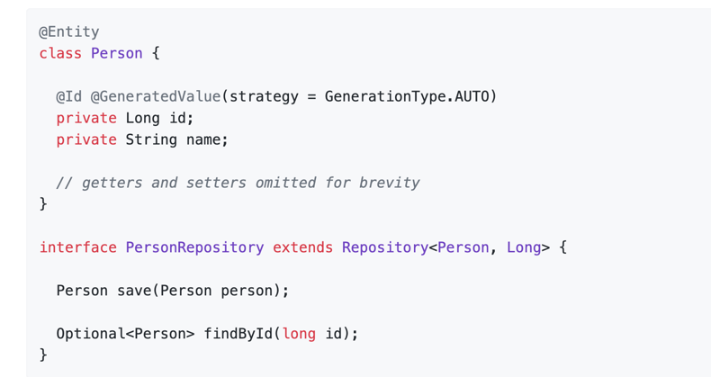

# 2024年7月24日工作任务安排

## 1. 学习JPA/Hibernate的基本概念和使用方法
- 了解JPA（Java Persistence API）是Java的ORM（对象关系映射）规范。
- 学习Hibernate是JPA的实现之一，提供了持久化和ORM功能。
- 研究JPA的核心概念，如实体（Entity）、实体管理器（EntityManager）、持久化上下文（Persistence Context）。
- 了解Hibernate特有的功能和优化策略，如缓存机制、懒加载（Lazy Loading）。

## 2. 使用Spring Data JPA进行数据库操作
- 学习Spring Data JPA如何简化JPA的开发过程。
- 配置Spring Data JPA，包括数据源设置、实体类和仓库接口的定义。
- 使用Spring Data JPA的仓库（Repository）接口进行常见数据库操作，如查询、保存、更新和删除。
- 了解Spring Data JPA提供的查询方法，如`findBy`、`countBy`等。

## 3. 编写CRUD操作的示例代码
- 创建一个简单的实体类（如`User`），并定义其属性（如`id`、`name`、`email`）。
- 定义对应的JPA仓库接口（如`UserRepository`），继承自`JpaRepository`。
- 实现基本的CRUD操作示例代码，包括创建（Create）、读取（Read）、更新（Update）和删除（Delete）。
- 测试CRUD操作的正确性，确保与数据库的交互正常。
 

## 4. 学习数据库事务管理
- 理解数据库事务的概念及其在数据一致性和完整性方面的重要性。
- 学习Spring中的事务管理，包括声明式事务管理和编程式事务管理。
- 了解事务的传播行为（Propagation）和隔离级别（Isolation Level）。
- 在示例代码中加入事务管理，确保复杂操作的原子性和数据的一致性。
