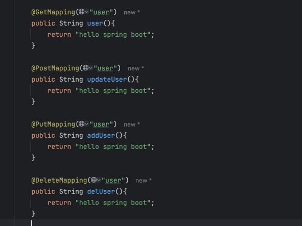

# 2024年7月25日工作任务安排

## 1. 学习RESTful API的基本概念和设计原则

- **RESTful API** 是一种基于REST（Representational State Transfer）架构风格的API设计方法。
- **基本概念**:
    - **资源**: 网络上的实体，可以是文档、图像、视频等。每个资源由一个URI标识。
    - **HTTP方法**: 用于操作资源的标准方法，包括 GET、POST、PUT、DELETE 等。
    - **状态表示**: 客户端与服务器之间通过数据交换资源的当前状态。
- **设计原则**:
    - **统一接口**: 使用标准化的URI和HTTP方法来操作资源。
    - **无状态性**: 每个请求都是独立的，服务器不会存储客户端的状态。
    - **可缓存性**: 允许响应数据被缓存以提高性能。
    - **分层系统**: 系统结构分层，以增强可扩展性和安全性。
    - **按需代码**: 在必要时将代码下载到客户端（如JavaScript）。

## 2. 使用Spring Boot开发RESTful API

- **Spring Boot** 是一个简化了Spring应用程序开发的框架。

## 3. 编写并测试API端点

- **编写端点**: 使用 `@GetMapping`、`@PostMapping`、`@PutMapping`、`@DeleteMapping` 等注解定义API操作。
- **测试端点**:
    - 使用 `@SpringBootTest` 和 `MockMvc` 进行单元测试和集成测试。
    - 验证API的行为、状态码、响应数据等。

## 4. 使用Postman或类似工具进行API测试

- **Postman** 是一个流行的API测试工具。
- **操作**:
    - **创建请求**: 在Postman中创建GET、POST、PUT、DELETE等请求。
    - **设置参数**: 配置请求的URL、头信息、查询参数和请求体。
    - **发送请求**: 发送请求并查看服务器响应。
    - **自动化测试**: 使用Postman的测试脚本功能进行自动化测试。

---
