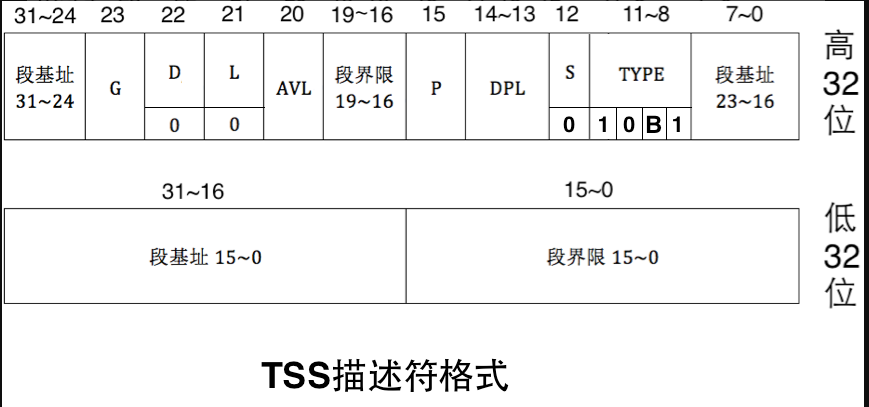
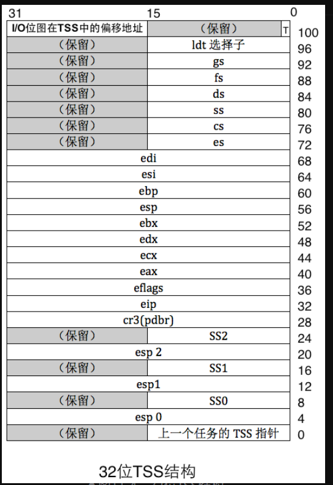

# tss (Task State Segment) 任务状态段
```text
tss用于记录任务切换时状态的快照,tss描述符存储在gdt中,
当前任务的tss存储在tr寄存器中
```
## tss描述符格式(tss描述符并不是tss)
```text
tss描述符可以获取到tss的基地址和界限
配合tss选择子才能找到真正的tss
```

- s=0 代表系统段
- type-b位=1 代表任务繁忙 0 代表空闲 由cpu操作,也防止被重入


