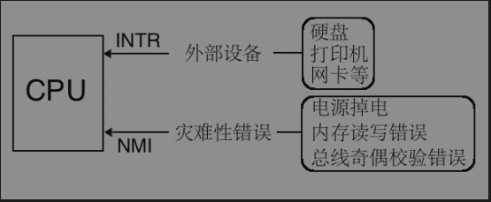
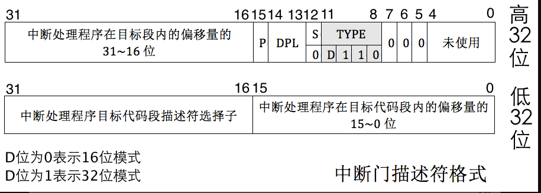
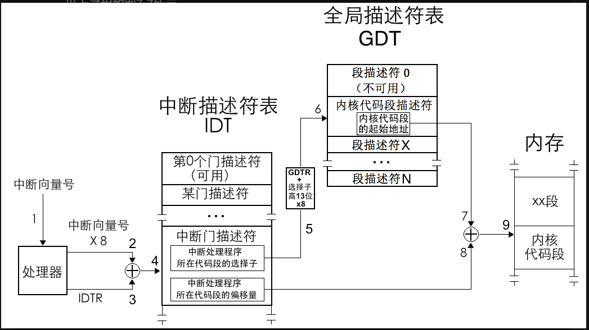

### 中断按照事件来源分类:
    外部中断: 
       可屏蔽中断:
       不可屏蔽中断:
    内部中断:
       软中断:
       异常:

#### 外部中断:
    外部中断的中断源是某个硬件,所以外部中断又称硬件中断。
    比如网卡收到网络数据包,会通知cpu,cpu得到通知以后将数据拷贝到内核缓冲区。

> 外部中断 如果cpu像单片机一样都提供gpio接口,那无穷无尽的外设肯定会不够用,
> 所以cpu提供统一的接口作为中断信号的公共线路

> cpu提供了两条信号线。INTR(InteRrupt)和NMI(Non Maskable Interrupt) 即可屏蔽和不可屏蔽中断(2)
> 

    
#### 内部中断
> 软中断：即软件中断
> int3

### 中断描述符表 idt interrupt descriptor table
> * 用于保护模式存储中断的,存中断描述符和任务门描述符和陷阱门描述符
> * 其实是存的一段代码的起始地址,所以又叫 门
> * 门 顾名思义 就是通往某个地方的大门，这里是一段程序
#### 中断门
包含 中断处理程序所在的段的段选择子 和 段内偏移量  才能得到一段程序
* linux就是使用的中断门实现的系统调用, int 0x80
* 中断门的 type=1110


### 中断描述符表寄存器 idtr interrupt descriptor table register
用于找到中断描述符表,6字节 48位,使用lidt 48位内存地址数据 来加载idt

* 0-15 存储idt的大小-1,最大2^16=64kb
* 16-47 中断描述符表的地址


```text
中断发生,处理器收到 中断向量号,根据中断向量号 -> 中断描述符表(对应中断描述符)
中断描述符中(代码段选择子,段内偏移量)处理器加载选择子到cs,偏移量到eip,把当前的cs:eip保存到中断处理程序的栈中
还需要保存标志寄存器eflags,牵扯到特权级变化还要压入ss和esp
```
```text
拿到中断描述符后,那cpl和选择子对应的目标代码段的dpl(在段描述符里)对比,cpl>dpl 表示向高特权级转移,所以处理器需要先
保存旧的ss和esp记作ss_old和esp_old,然后再tss里找到dpl级别的栈,加载到ss和esp
```